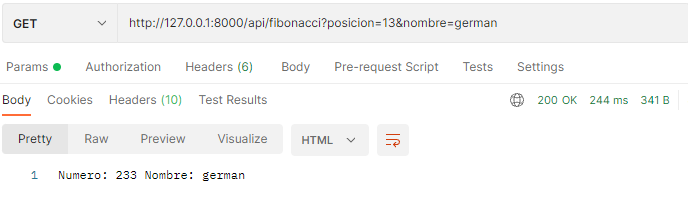
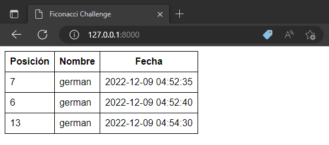

# Fibonacci Challenge - Instrucciones


## Instalación

### Ejecute los siguientes comandos en su máquina host:

*  `git clone git@github.com:gerchavarin/fibonacci-challenge.git`
*  `cd fibonacci-challenge`
*  `cp .env.example .env`
*  _Modifica las siguientes variables en el archivo .env_
```
DB_DATABASE=(nombre de la base de datos)
DB_USERNAME=(tu usuario)
DB_PASSWORD=(tu password)
```
*  `composer install`
*  `php artisan migrate`

## Ejecución

Comando para iniciar el proyecto
`php artisan serve`

## Funcionamiento

Para calcular un número de Fibonacci debe de hacer una petición al endpoint http://127.0.0.1:8000/api/fibonnaci enviándole los parámetros **posicion** y **nombre**




También puede ver el historial de peticiones que se han hecho a la API, debe de entrar desde el navegador web a la url http://127.0.0.1:8000



Autor: German Chavarín ([@gerchavarin](https://www.linkedin.com/in/gerchavarin/))